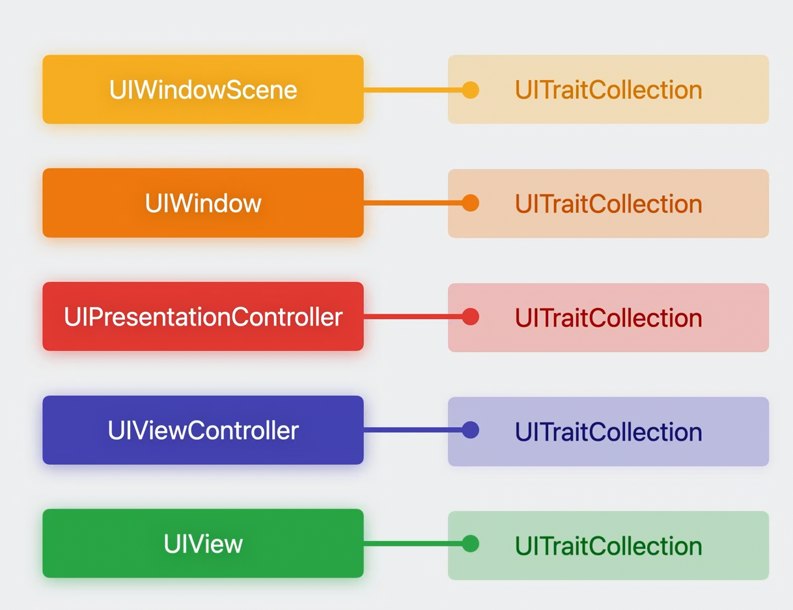
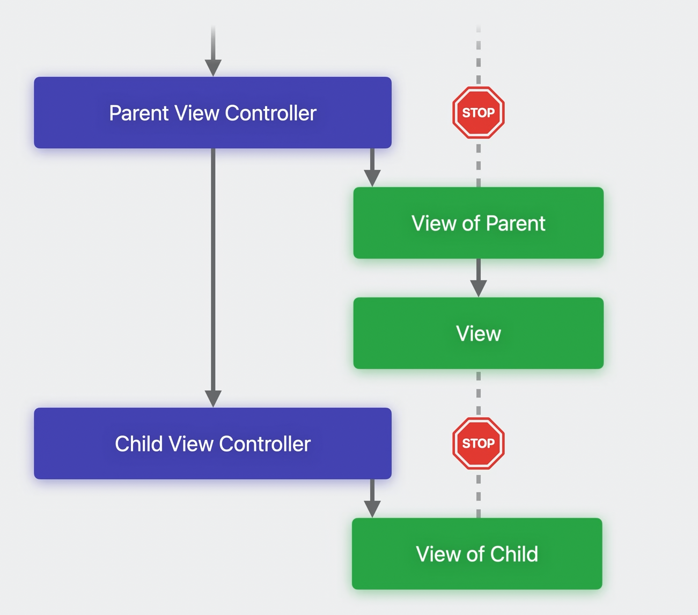
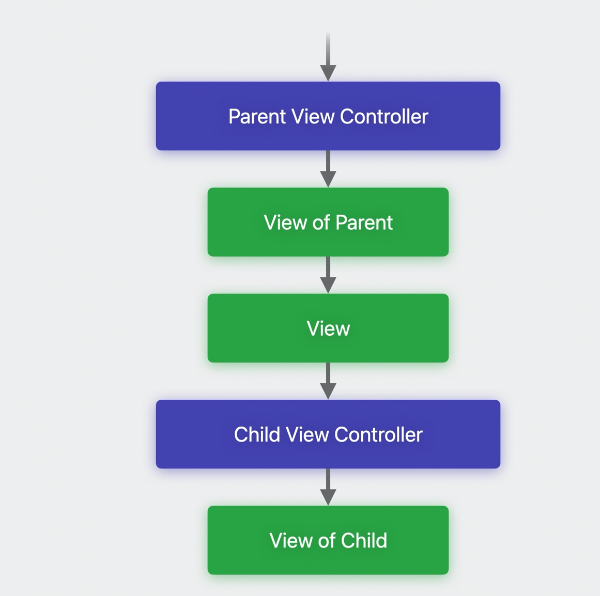
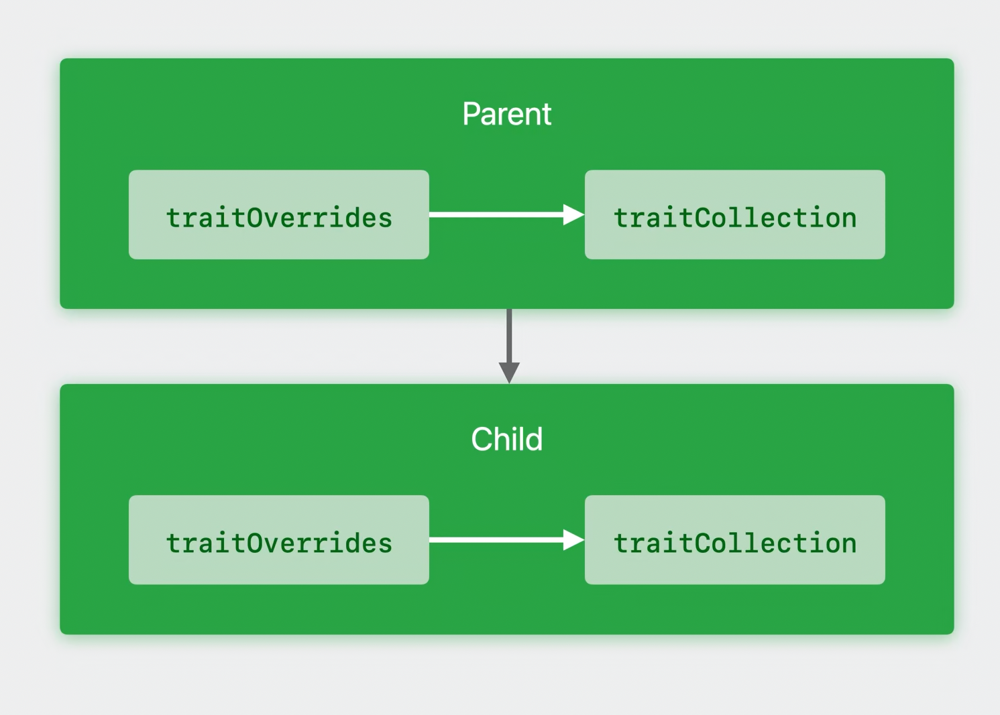

# Custom Trait

[Apple Doc]()

## Introduction traitCollection

Trait environments in your app are window scenes, windows, presentation controllers, view controllers, and views. Every one of these trait environments has its own trait collection, and each trait collection may contain different values.  


Each trait environment inherits trait values from its parent environment.

Before 17


iOS 17


## Updates in iOS 17

### mubtaleTraits

```swift
// ios 16
let legacyTraits = UITraitCollection(userInterfaceIdiom: .phone)
//❌
//myTraits.userInterfaceStyle = .unspecified

// Build from scratch
let myTraits = UITraitCollection { mutableTraits in
    mutableTraits.userInterfaceIdiom = .phone
    mutableTraits.horizontalSizeClass = .regular
}

// Build a new instance by modifying an existing one
let otherTraits = myTraits.modifyingTraits { mutableTraits in
    mutableTraits.userInterfaceStyle = .dark
}
```

### define cutom trait

```swift
// Implemneting a simple custom trait
struct CustomTrait: UITraitDefinition {
    static let defaultValue = false
    // system will redraw ui everty time this trait changed
    static let affectsColorAppearance = true
    static let name = "balabala"
    static let identifier = "baba.lala"
}

extension UITraitCollection {
    var customTrait: Bool { self[CustomTrait.self] }
}

extension UIMutableTraits {
    var customTrait: Bool {
        get { self[CustomTrait.self] }
        set { self[CustomTrait.self] = newValue }
    }
}

let myTraits = UITraitCollection { mutableTraits in
    mutableTraits[CustomTrait.self] = true
    mutableTraits.customTrait = false
}
```

Use value types `Bool` `Int`, `Double`, `Enum` with type `Int`
Custom types must implement Equtable protocol.

### Trait Override

New `traitOverrides` property on trait environment  

* UIWindowScene
* UIView
* UIViewController
* UIPresentationController

like `traitColelction`, `traitOverrides` will be inherited to subviews/controllers.



```swift
self.traitOverrides.userInterfaceStyle = .dark
self.traitOverrides.customTrait = true
self.traitOverrides.themeTrait = .yellow

// remove override
self.traitOverrides.remove(CustomTrait.self)
```

### Handling change

`traitCollectionDidChange(_:)` is deprecated.

new APIs:

```swift
// add register for traitCollection changes
let reg = registerForTraitChanges([UITraitHorizontalSizeClass.self]) {
    (self: Self, previousTraitCollection: UITraitCollection) in
    print("horizontal size class  updated")
}
registerForTraitChanges([UITraitUserInterfaceStyle.self, CustomTrait.self],
                        target: self, action: #selector(handleTraitChange))

// unregister
unregisterForTraitChanges(reg)
```

There are some predefined system traitCollections array.

```swift
print(UITraitCollection.systemTraitsAffectingImageLookup)
//   - 0 : UIKit.UITraitAccessibilityContrast
//   - 1 : UIKit.UITraitPreferredContentSizeCategory
//   - 2 : UIKit.UITraitArtworkSubtype
//   - 3 : UIKit.UITraitLayoutDirection
//   - 4 : UIKit.UITraitVerticalSizeClass
//   - 5 : UIKit.UITraitHorizontalSizeClass
//   - 6 : UIKit.UITraitDisplayGamut
//   - 7 : UIKit.UITraitUserInterfaceStyle
//   - 8 : UIKit.UITraitLegibilityWeight
//   - 9 : UIKit.UITraitUserInterfaceIdiom
//   - 10 : UIKit.UITraitDisplayScale
print(UITraitCollection.systemTraitsAffectingColorAppearance)
//   - 0 : UIKit.UITraitSelectionIsKey
//   - 1 : UIKit.UITraitUserInterfaceLevel
//   - 2 : UIKit.UITraitAccessibilityContrast
//   - 3 : UIKit.UITraitDisplayGamut
//   - 4 : UIKit.UITraitUserInterfaceRenderingMode
//   - 5 : UIKit.UITraitUserInterfaceStyle
//   - 6 : UIKit.UITraitVibrancy
//   - 7 : UIKit.UITraitUserInterfaceIdiom
```

### ViewIsAppearing()

**TraitCollection will not be updated in subviews until they are added to view hierarchy.**

Trait not up-to-date in `viewWillAppear(_:)`.  
Trait updated in `viewIsAppearing()`.

* View controller and view traits up-to-date
* View added to hierarchy, has accurate geometry

**Views update traits before layout.**
`layoutSubviews()` is the best place to use traits.

```swift
class EmbedController {
    override func viewDidLoad() {
        super.viewDidLoad()
        print("didLoad:")
        print(traitCollection.customTrait)
    }

    override func viewWillAppear(_ animated: Bool) {
        super.viewWillAppear(animated)
        print("willAppear:")
        print(traitCollection.customTrait)
    }

    override func viewIsAppearing(_ animated: Bool) {
        super.viewIsAppearing(animated)
        print("isAppearing:")
        print(traitCollection.customTrait)
    }
}

    /* results:
    didLoad:
    true
    willAppear:
    false
    isAppearing:
    true
    */
```

## Conclusion

### Maximize performance

Only register for traits you depend on  
Invalidate in response to changes  
