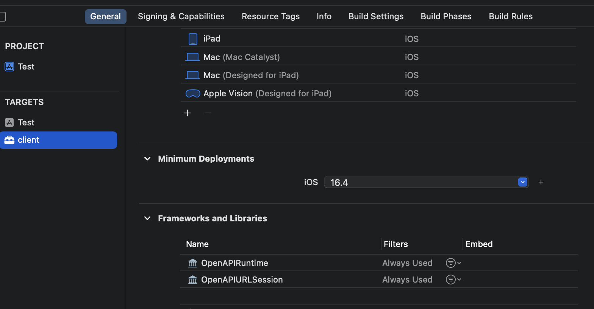
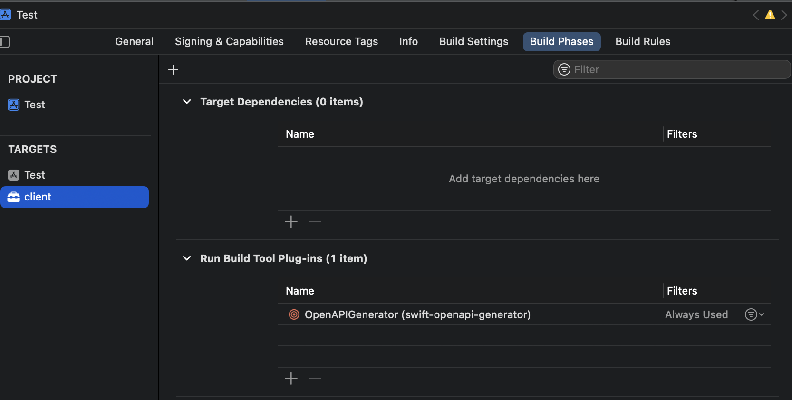

# Swift OpenAPI generator

Reference:  
[WWDC Meet Swift OpenAPI Generator](https://developer.apple.com/wwdc23/10171)  
[Github](https://github.com/apple/swift-openapi-generator/tree/main)
[OpenAPI specification](https://spec.openapis.org/oas/v3.1.0)

## Why

Outdated, incomplete, inconsistent.

## What

* Swift package plugin
* Code generated at build time
* Always in sync with the OpenAPI document
* No need to commit to source control

## How

### file structure

```any
.
├── Package.swift
└── Sources
    └── MyTarget
        ├── MyCode.swift
        ├── openapi-generator-config.yaml <---generator config
        └── openapi.yaml <--------------------opanapi doc
```

### clinet

1. Add a new framewok target
2. Add OpenAPI config yaml
```yaml
openapi: "3.0.3"
info:
  title: "GreetingService"
  version: "1.0.0"
servers:
- url: "http://localhost:8080/api"
  description: "Production"
paths:
  /greet:
    get:
      operationId: "getGreeting"
      parameters:
      - name: "name"
        required: false
        in: "query"
        description: "Personalizes the greeting."
        schema:
          type: "string"
      responses:
        "200":
          description: "Returns a greeting"
          content:
            application/json:
              schema:
                $ref: "#/components/schemas/Greeting"
components:
  schemas:
    Greeting:
      type: object
      properties:
        message:
          type: string
      required:
        - message
```
3. Add OpenAPI generator config yaml
```yaml
generate:
  - types #Common types and abstractions used by generated client and server code.
  - client #Client code that can be used with any client transport (depends on code from types).
# - server: Server code that can be used with any server transport (depends on code from types).
```
4. Add plugin and Package dependency
5. Build and test the API has been generated
```swift
import OpenAPIRuntime
import OpenAPIURLSession

let client = Client(
    serverURL: try Servers.server2(),
    transport: URLSessionTransport()
)

let response = try await client.getGreeting(
    .init(
        query: .init(name: "CLI")
    )
)
print(response)
```

### server stub

1. Add a new framewok target
2. Add OpenAPI config yaml
3. Add OpenAPI generator config yaml
```yaml
generate:
  - types
  - server
```
4. Add plugin and Package dependency
5. Build and test the API has been generated
```swift
import Foundation
import Vapor
import OpenAPIRuntime
import OpenAPIVapor

// Define a type that conforms to the generated protocol.
struct GreetingServiceAPIImpl: APIProtocol {
    func getGreeting(
        _ input: Operations.getGreeting.Input
    ) async throws -> Operations.getGreeting.Output {
        let name = input.query.name ?? "Stranger"
        let greeting = Components.Schemas.Greeting(message: "Hello, \(name)!")
        return .ok(.init(body: .json(greeting)))
    }
}

// Create your Vapor application.
let app = Vapor.Application()

// Create a VaporTransport using your application.
let transport = VaporTransport(routesBuilder: app)

// Create an instance of your handler type that conforms the generated protocol
// defininig your service API.
let handler = GreetingServiceAPIImpl()

// Call the generated function on your implementation to add its request
// handlers to the app.
try handler.registerHandlers(on: transport, serverURL: Servers.server1())

// Start the app as you would normally.
try app.run()
```